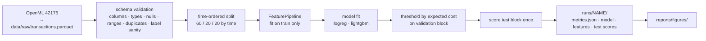
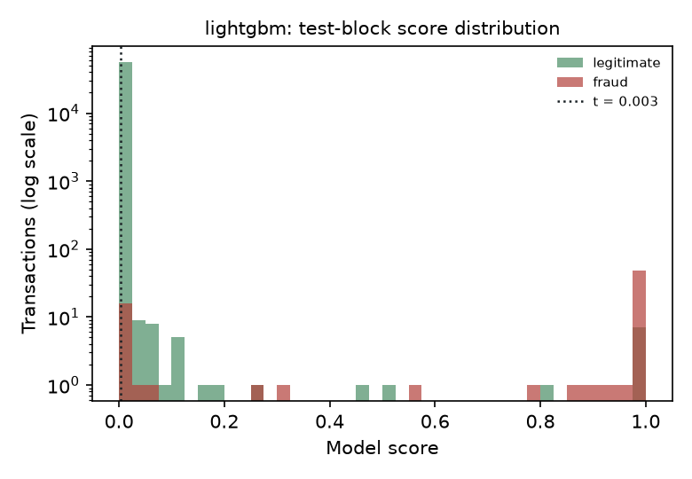

# Fraud detection platform

An end-to-end card-fraud system built in five stages. This is **stage 1 of 5**: the modelling core with the discipline a production system needs before anything is served: validated inputs, time-ordered evaluation, a threshold chosen by business cost rather than F1, and a report that says what an analyst team would actually experience.

| stage | scope | status |
|---|---|---|
| 1 | data validation, time split, features, two models, cost-based threshold, evaluation, tests, CI | **this release** |
| 2 | experiment tracking and model registry, calibration, threshold uncertainty | planned |
| 3 | real-time scoring API and batch scoring job, Docker Compose | planned |
| 4 | monitoring: score and feature drift, alert-rate and precision tracking, drift simulation | planned |
| 5 | scheduled retraining with quality gates, dashboard, architecture write-up | planned |

## The problem

A card issuer sees hundreds of thousands of transactions a day; a fraction of a percent are fraud. Every alert the model raises goes to an analyst, and every fraud it misses is money lost. The model therefore has two customers with opposite needs: the analyst team wants few, precise alerts; the finance team wants the expensive frauds caught. A threshold that maximises F1 serves neither, because F1 counts a ₹9 fraud and a ₹2,000 fraud as the same mistake.

This platform makes that trade explicit. The alert threshold is the score at which *review cost × alerts + value of missed fraud* is smallest on data the model has never seen, and the report shows the cost curve so the operating point can be moved when the analyst team grows or shrinks.

## Data

The ULB credit-card fraud dataset (284,807 European card transactions over two days in September 2013, 492 fraudulent, 0.17%), fetched from OpenML on first use and cached as Parquet. Features `V1..V28` are PCA components published to protect confidentiality; `time` (seconds since the first transaction) and `amount` are raw. Fraud transactions are small on average (median ₹9 versus ₹22 for legitimate ones) but with a long tail.

It is the standard public benchmark and its limits are real: anonymised features rule out most domain feature engineering, two days is too short for seasonal effects, and there are no card or merchant identifiers for velocity features. The platform is written so that swapping in a richer source means changing `data/source.py` and `data/schema.py`, nothing else.

## Pipeline



**Validation before anything.** `fraud_platform.data.schema` checks the frame every training run and every scoring call. Errors (missing columns, nulls, negative amounts, duplicate ids, a label that is not 0/1, no positives) stop the run; warnings (extreme values, unsorted time, an implausible fraud rate) are logged and stored in the run's metrics file.

**Time-ordered split, no exceptions.** A random split leaks the future into training. The data is sorted by time and cut into contiguous train, validation and test blocks. The blocks have different fraud rates (0.21%, 0.10%, 0.13%), which is exactly the kind of shift a deployed model faces and which a random split would hide.

**One feature pipeline for every code path.** `FeaturePipeline` is fit on the training block, serialised next to the model, and reused by batch and real-time scoring, so training and serving cannot compute features differently. It adds a log amount, hour of day as sine and cosine, a night flag, an "amount unusual for this hour" z-score learned from training data, and passes the PCA components through. Raw `time` is never a feature: it increases through the split and would let any model learn "later means test set".

**Threshold by cost.** `evaluation.cost` sweeps candidate thresholds on the validation block and picks the one minimising review cost plus missed-fraud value (defaults: ₹10 per review, missed fraud costs its amount). The test block is scored once with that threshold.

## Results

Test block: 56,962 transactions, 75 frauds. Threshold chosen on the validation block (56,961 transactions, 57 frauds). Full numbers in `runs/<name>/metrics.json`; figures in `reports/figures/`.

| model | PR-AUC | ROC-AUC | precision | recall | alerts (rate) | recall at 0.1% FPR | P@R=0.7 | P@R=0.9 | ECE | fit |
|---|---|---|---|---|---|---|---|---|---|---|
| logreg (balanced) | 0.748 | 0.981 | 0.399 | 0.840 | 158 (0.28%) | 0.800 | 0.746 | 0.033 | 0.101 | 0.2 s |
| lightgbm | **0.782** | 0.982 | 0.351 | 0.813 | 174 (0.31%) | 0.787 | **0.883** | 0.030 | 0.0004 | 4.2 s |

| model | expected cost on test | cost if never alerting | saved | fraud value caught | fraud value missed |
|---|---|---|---|---|---|
| logreg | ₹3,950 | ₹7,729 | ₹3,779 | ₹5,359 | ₹2,370 |
| lightgbm | ₹4,356 | ₹7,729 | ₹3,374 | ₹5,114 | ₹2,616 |

 

What the numbers say, and what they do not:

- **Both models catch about 80% of fraud while alerting on 0.3% of transactions**, roughly 160 to 175 reviews per 57,000 transactions, one in three of them real. ROC-AUC of 0.98 for both is true and useless; PR-AUC and precision at fixed recall are what separate them.
- **The last 10% of fraud is very expensive.** Precision collapses from 0.88 at 70% recall to 0.03 at 90% recall for LightGBM. Getting from 80% to 90% recall would mean reviewing roughly thirty times as many transactions. That is the number to show a stakeholder who asks for "catch everything".
- **LightGBM ranks better; logistic regression cost less on this test block.** The validation block has 57 frauds, so the cost-optimal threshold is chosen from very few events and the test-block cost outcome is dominated by a handful of high-value frauds. Stage 2 will bootstrap the threshold choice and report a confidence interval instead of a point, which is the honest version of this comparison.
- **The probabilities are not probabilities yet.** Class weighting inflates the logistic scores (ECE 0.10, threshold at 0.98); LightGBM's `scale_pos_weight` does the opposite and its chosen threshold is 0.003. Ranking is unaffected, cost thresholding is unaffected, but anything that reads the score as a probability needs the calibration step planned for stage 2.
- **The tree model rests on one feature.** `V14` accounts for 86% of LightGBM's split gain; the logistic model spreads weight over `V4`, `V12`, `V14`, `V8`, `V10` and the engineered `amount_z_hour`. A single dominant feature is a fragility to monitor: if `V14`'s distribution drifts, the model fails quietly. That is the case for stage 4.


## Reproduce

```bash
git clone https://github.com/kiran-bal/fraud-detection-platform && cd fraud-detection-platform
make setup            # uv venv + editable install with dev extras (macOS: brew install libomp for LightGBM)
make fetch            # one-time download to data/raw/ (about 150 MB)
make train-all        # both configs: ~10 s total
make test             # 20 tests on a synthetic fixture, no download needed
```

Batch scoring with a saved run:

```bash
fraud-score --run runs/lightgbm --input transactions.parquet --output scored.parquet
```

## Project structure

```
configs/                    logreg.yaml, lightgbm.yaml: model params, split fractions, costs
src/fraud_platform/
├── config.py               RunConfig, SplitConfig, CostConfig, paths
├── data/
│   ├── source.py           OpenML fetch + Parquet cache (fraud-fetch)
│   ├── schema.py           TransactionSchema, validate(), ValidationReport
│   └── split.py            time_split()
├── features/pipeline.py    FeaturePipeline (fit on train, reused everywhere)
├── models/                 registry: logreg, lightgbm; save/load; feature importance
├── evaluation/
│   ├── metrics.py          PR-AUC, precision at recall, recall at FPR, calibration
│   ├── cost.py             expected cost, cost curve, threshold choice
│   └── report.py           figures
├── train.py                fraud-train
└── predict.py              fraud-score (batch) and Scorer (library)
tests/                      synthetic-data tests for every module and an end-to-end run
reports/figures/            committed figures from the runs above
.github/workflows/ci.yml    ruff + pytest on 3.11 and 3.12
```

## Design decisions worth stating

- **Errors versus warnings in validation.** Anything that would make a score meaningless (missing feature, null, wrong label domain) is an error and stops the job. Anything that is merely suspicious is a warning that is recorded, so a slow change in the data leaves a trail in the run history.
- **Cost, not F1.** The review cost and loss multiplier are configuration, because they differ per issuer and per quarter. Changing them and re-running gives a new threshold and a new cost curve without touching a model.
- **Two models, deliberately.** The linear model is the baseline every tree model has to beat and the one that is easiest to explain to a risk committee. Keeping it in the comparison table is what made the cost-versus-ranking disagreement visible.

## Limitations at this stage

- No calibration, no uncertainty on the threshold, no experiment tracking (stage 2).
- No serving path beyond the batch CLI (stage 3).
- No monitoring; the `V14` dependency noted above is unguarded (stage 4).
- Single public dataset with anonymised features; velocity and merchant features, the strongest signals in real fraud systems, are not possible here.
