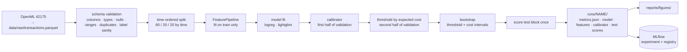
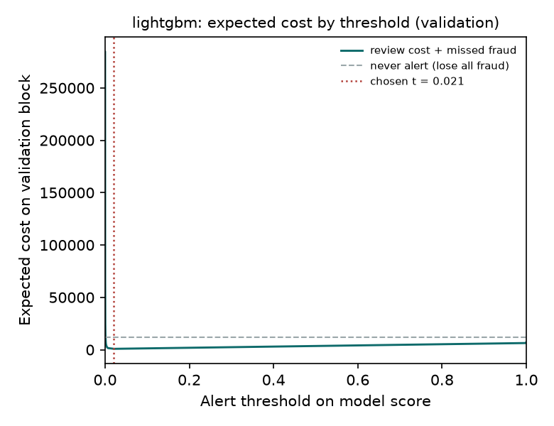
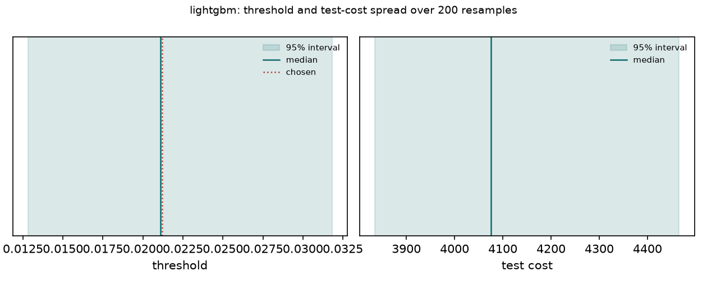
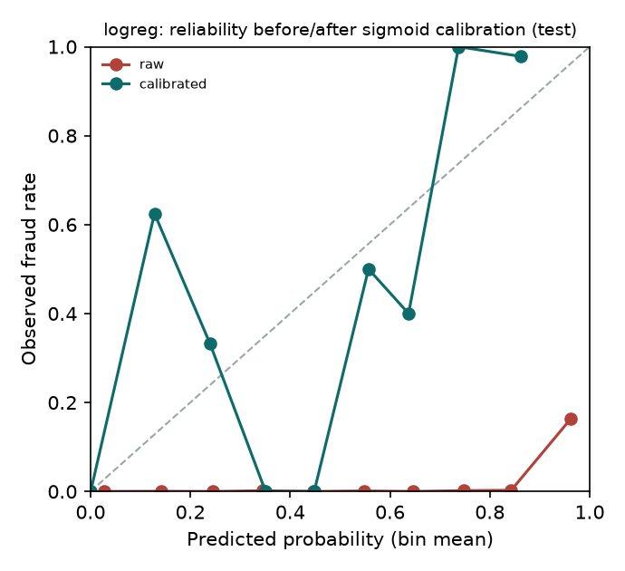
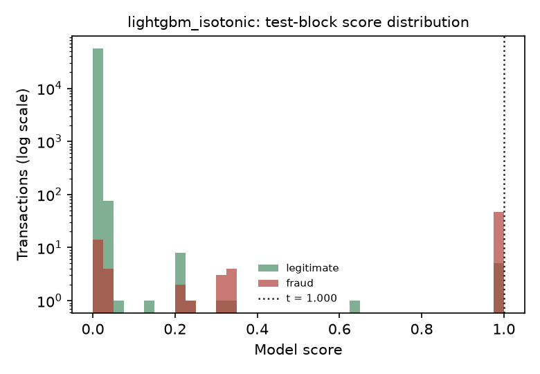
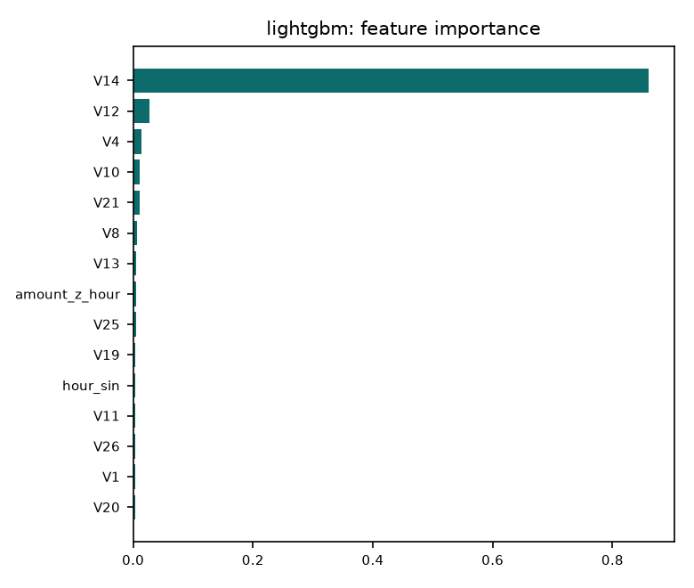

# Fraud detection platform

An end-to-end card-fraud system built in five stages. Stages 1 and 2 are done: the modelling core (validated inputs, time-ordered evaluation, a threshold chosen by business cost rather than F1) plus the discipline around it (experiment tracking, a model registry with a promotion gate, calibrated probabilities, and confidence intervals on the threshold and the cost so nobody oversells a point estimate).

| stage | scope | status |
|---|---|---|
| 1 | data validation, time split, features, two models, cost-based threshold, evaluation, tests, CI | done |
| 2 | MLflow tracking and registry with a promotion gate, calibration, bootstrap intervals on threshold and cost | **this release** |
| 3 | real-time scoring API and batch scoring job, Docker Compose | planned |
| 4 | monitoring: score and feature drift, alert-rate and precision tracking, drift simulation | planned |
| 5 | scheduled retraining with quality gates, dashboard, architecture write-up | planned |

## The problem

A card issuer sees hundreds of thousands of transactions a day; a fraction of a percent are fraud. Every alert the model raises goes to an analyst, and every fraud it misses is money lost. The model therefore has two customers with opposite needs: the analyst team wants few, precise alerts; the finance team wants the expensive frauds caught. A threshold that maximises F1 serves neither, because F1 counts a ₹9 fraud and a ₹2,000 fraud as the same mistake.

This platform makes that trade explicit. The alert threshold is the score at which *review cost × alerts + value of missed fraud* is smallest on data the model has never seen, and the report shows the cost curve so the operating point can be moved when the analyst team grows or shrinks.

## Data

The ULB credit-card fraud dataset (284,807 European card transactions over two days in September 2013, 492 fraudulent, 0.17%), fetched from OpenML on first use and cached as Parquet. Features `V1..V28` are PCA components published to protect confidentiality; `time` (seconds since the first transaction) and `amount` are raw. Fraud transactions are small on average (median ₹9 versus ₹22 for legitimate ones) but with a long tail.

It is the standard public benchmark and its limits are real: anonymised features rule out most domain feature engineering, two days is too short for seasonal effects, and there are no card or merchant identifiers for velocity features. The platform is written so that swapping in a richer source means changing `data/source.py` and `data/schema.py`, nothing else.

## Pipeline



**Validation before anything.** `fraud_platform.data.schema` checks the frame every training run and every scoring call. Errors (missing columns, nulls, negative amounts, duplicate ids, a label that is not 0/1, no positives) stop the run; warnings (extreme values, unsorted time, an implausible fraud rate) are logged and stored in the run's metrics file.

**Time-ordered split, no exceptions.** A random split leaks the future into training. The data is sorted by time and cut into contiguous train, validation and test blocks. The blocks have different fraud rates (0.21%, 0.10%, 0.13%), which is exactly the kind of shift a deployed model faces and which a random split would hide.

**One feature pipeline for every code path.** `FeaturePipeline` is fit on the training block, serialised next to the model, and reused by batch and real-time scoring, so training and serving cannot compute features differently. It adds a log amount, hour of day as sine and cosine, a night flag, an "amount unusual for this hour" z-score learned from training data, and passes the PCA components through. Raw `time` is never a feature: it increases through the split and would let any model learn "later means test set".

**Calibrate, then choose the threshold, on disjoint data.** The validation block is cut in half by time. The first half fits a calibrator (`sigmoid` or `isotonic`, `evaluation.calibration`); the second half is where `evaluation.cost` sweeps candidate thresholds and picks the one minimising review cost plus missed-fraud value (defaults: ₹10 per review, missed fraud costs its amount). The test block is scored once, through the calibrator, with that threshold. Calibrating and thresholding on the same rows would let the calibrator's fit leak into the threshold choice.

**Say how sure you are.** `evaluation.uncertainty` resamples the selection half 200 times and re-chooses the threshold each time, then applies every resampled threshold to the test block. That gives an interval on the threshold *and* on what its instability costs. A second bootstrap resamples the test block at the chosen threshold to show plain sampling noise in the headline cost.

**Track everything, promote through a gate.** Every run is logged to MLflow (`tracking.py`): flattened parameters, validation, test, cost and uncertainty metrics, the run directory as artifacts, and a `pyfunc` model that bundles features, model and calibrator so `mlflow models serve` scores exactly like the batch job. Each run registers a new version of `fraud-detector`. `fraud-promote --version N` moves the `champion` alias only if the candidate's test PR-AUC is not more than 0.01 below the current champion's and its test cost is not more than 1% higher.

## Results

Test block: 56,962 transactions, 75 frauds. Calibrator fitted on 28,480 validation rows (24 frauds); threshold chosen on the other 28,481 (33 frauds). Full numbers in `runs/<name>/metrics.json` and `reports/results.md`; figures in `reports/figures/`.

| run | calibration | PR-AUC | precision | recall | alerts | P@R=0.7 | ECE raw → cal | test cost | threshold 95% CI | cost if threshold re-chosen (95%) |
|---|---|---|---|---|---|---|---|---|---|---|
| logreg | sigmoid | 0.780* | 0.472 | 0.800 | 127 | 0.746 | 0.101 → 0.0004 | **₹3,668** | 0.015 – 0.862 | ₹3,438 – 5,318 |
| lightgbm | sigmoid | **0.782** | 0.418 | 0.813 | 146 | **0.883** | 0.0004 → 0.0002 | ₹4,076 | 0.013 – 0.032 | ₹3,835 – 4,466 |
| lightgbm_raw | none | 0.782 | 0.418 | 0.813 | 146 | 0.883 | 0.0004 | ₹4,076 | 0.002 – 0.009 | ₹3,835 – 4,466 |
| lightgbm_isotonic | isotonic | 0.708 | 0.904 | 0.627 | 52 | 0.883 | 0.0004 → 0.0002 | ₹4,691 | 0.036 – 1.000 | ₹4,166 – 4,691 |

Cost if never alerting: ₹7,729. Sampling noise of the test cost at the chosen threshold, from resampling the 75 test frauds: roughly ₹1,600 – 6,500 for every model.

 

What the numbers say, and what they do not:

- **Both models catch about 80% of fraud while alerting on 0.2 to 0.3% of transactions**, roughly 130 to 150 reviews per 57,000 transactions, two in five of them real. ROC-AUC of 0.98 for both is true and useless; PR-AUC and precision at fixed recall are what separate them.
- **The last 10% of fraud is very expensive.** Precision falls from 0.88 at 70% recall to 0.03 at 90% recall for LightGBM. Getting from 80% to 90% recall would mean reviewing roughly thirty times as many transactions. That is the number to show a stakeholder who asks for "catch everything".
- **The cost difference between the two models is inside the noise.** Logistic regression is ₹400 cheaper on this test block, but the 95% interval from resampling the test frauds is ₹5,000 wide for both. The registry gate still promoted logreg because it is not worse on either criterion; the honest statement is that the two are indistinguishable on cost here and LightGBM ranks slightly better. A longer evaluation window is the fix, not a better model.
- **Threshold stability is where the models differ most.** LightGBM's cost-optimal threshold lands in a narrow band (0.013 – 0.032 calibrated) and re-choosing it on a resample moves the test cost by at most ±8%. Logistic regression's cost curve is flat across a huge range (0.015 – 0.862), so the "optimal" threshold is essentially arbitrary and a resample can move the test cost by 45%. Flat cost curves look like robustness and are actually the opposite: the operating point is unidentified.
- **Sigmoid calibration fixes the logistic probabilities** (ECE 0.10 → 0.0004) and changes nothing for LightGBM, whose raw scores were already well calibrated in the aggregate because almost all of them sit near zero. Calibration never changes the alerts: the same transactions sit above the (transformed) threshold.
- **Isotonic calibration with 24 frauds is a trap.** It collapsed 56,000 distinct scores into 23 plateaus, PR-AUC dropped to 0.708 through the ties, and the chosen threshold became 1.0, alerting only on the top plateau. The gate rejected it. With hundreds of positives isotonic is the better method; with dozens, use Platt scaling.
- **\* The logistic PR-AUC "improvement" after calibration (0.748 → 0.780) is an artifact.** 45 test transactions saturate at a raw score of 1.0 to float precision, 44 of them fraud. The calibrator clips before the logit and merges that block into a tie, which scikit-learn's average precision then scores as one step at 44/45 precision instead of whatever order floating-point noise had put them in. The ranking did not improve; the tie handling did. Reporting PR-AUC on raw scores is the right comparison, and it is 0.748.
- **The tree model rests on one feature.** `V14` accounts for 86% of LightGBM's split gain; the logistic model spreads weight over `V4`, `V12`, `V14`, `V8`, `V10` and the engineered `amount_z_hour`. A single dominant feature is a fragility to monitor: if `V14`'s distribution drifts, the model fails quietly. That is the case for stage 4.

 



## Reproduce

```bash
git clone https://github.com/kiran-bal/fraud-detection-platform && cd fraud-detection-platform
make setup            # uv venv + editable install with dev extras (macOS: brew install libomp for LightGBM)
make fetch            # one-time download to data/raw/ (about 150 MB)
make train-all        # four configs, ~40 s total; each run is logged to MLflow and registered
make compare          # reports/results.md
make test             # 29 tests on a synthetic fixture, no download needed
```

```bash
fraud-promote --version 3           # gate: PR-AUC and cost against the current champion
mlflow ui --backend-store-uri sqlite:///mlflow.db     # browse runs, artifacts and the registry
fraud-score --run runs/lightgbm --input transactions.parquet --output scored.parquet   # batch scoring
fraud-train --config configs/lightgbm.yaml --no-tracking                             # offline / CI
```

`MLFLOW_TRACKING_URI` and `MLFLOW_ARTIFACT_LOCATION` point tracking at a shared server; the default is a local SQLite database and `mlruns/`, both gitignored.

## Project structure

```
configs/                    logreg, lightgbm, lightgbm_raw, lightgbm_isotonic: params, split, costs, calibration
src/fraud_platform/
├── config.py               RunConfig, SplitConfig, CostConfig, paths
├── data/
│   ├── source.py           OpenML fetch + Parquet cache (fraud-fetch)
│   ├── schema.py           TransactionSchema, validate(), ValidationReport
│   └── split.py            time_split()
├── features/pipeline.py    FeaturePipeline (fit on train, reused everywhere)
├── models/                 registry: logreg, lightgbm; save/load; feature importance
├── evaluation/
│   ├── metrics.py          PR-AUC, precision at recall, recall at FPR, ECE
│   ├── cost.py             expected cost, cost curve, threshold choice
│   ├── calibration.py      Calibrator: none | sigmoid | isotonic
│   ├── uncertainty.py      bootstrap intervals on threshold and cost
│   └── report.py           figures
├── tracking.py             MLflow logging, pyfunc model, registry, fraud-promote gate
├── compare.py              fraud-compare → reports/results.md
├── train.py                fraud-train
└── predict.py              fraud-score (batch) and Scorer (features → model → calibrator)
tests/                      synthetic-data tests for every module and an end-to-end run
reports/figures/            committed figures from the runs above
.github/workflows/ci.yml    ruff + pytest on 3.11 and 3.12
```

## Design decisions worth stating

- **Errors versus warnings in validation.** Anything that would make a score meaningless (missing feature, null, wrong label domain) is an error and stops the job. Anything that is merely suspicious is a warning that is recorded, so a slow change in the data leaves a trail in the run history.
- **Cost, not F1.** The review cost and loss multiplier are configuration, because they differ per issuer and per quarter. Changing them and re-running gives a new threshold and a new cost curve without touching a model.
- **Two models, deliberately.** The linear model is the baseline every tree model has to beat and the one that is easiest to explain to a risk committee. Keeping it in the comparison table is what made the cost-versus-ranking disagreement visible.
- **Intervals before decimals.** Every headline number in the results table has a bootstrap interval next to it in `metrics.json`. The interval is what decides whether a difference between two runs is a finding or noise, and on this dataset it usually says noise.
- **The gate is deliberately simple.** Two criteria, both relative to the current champion, both with a tolerance. A gate that nobody can explain gets bypassed.

## Limitations at this stage

- No serving path beyond the batch CLI and `mlflow models serve` (stage 3).
- No monitoring; the `V14` dependency noted above is unguarded (stage 4).
- Single public dataset with anonymised features; velocity and merchant features, the strongest signals in real fraud systems, are not possible here.
